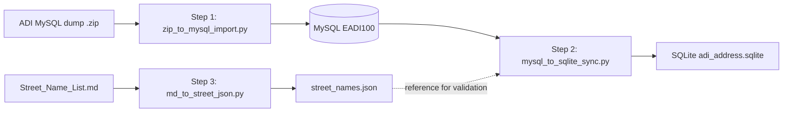

# ADI Address Converter — Project Guide

> A pipeline that converts the **Hong Kong ADI (Address Data Infrastructure)** address dataset from a raw MySQL dump into a **SQLite** database with trilingual (Traditional Chinese / Simplified Chinese / English) address fields, full-text search, and data-quality enrichment.

---

## Table of Contents

1. [Overview](#1-overview)
2. [Project Structure](#2-project-structure)
3. [How It Works (Pipeline)](#3-how-it-works-pipeline)
4. [Prerequisites & Installation](#4-prerequisites--installation)
5. [Configuration](#5-configuration)
6. [Usage](#6-usage)
   - [Step 1 — Import MySQL dump](#step-1--import-mysql-dump)
   - [Step 2 — Convert MySQL → SQLite](#step-2--convert-mysql--sqlite)
   - [Step 3 — (Optional) Rebuild street name table](#step-3--optional-rebuild-street-name-table)
7. [Output Schema](#7-output-schema)
8. [Query Examples](#8-query-examples)
9. [Data-Quality Features](#9-data-quality-features)
10. [CLI Reference](#10-cli-reference)
11. [Troubleshooting](#11-troubleshooting)

---

## 1. Overview

The **ADI Address Converter** ingests the official Hong Kong ADI address dataset (distributed as a compressed MySQL dump), loads it into a MySQL server, and then migrates it into a self-contained **SQLite** database optimized for fast, trilingual address lookup.

Key capabilities:

- **Trilingual output** — every address is produced in Traditional Chinese (`tc_*`), Simplified Chinese (`sc_*`, via `zhconv`), and English (`en_*`).
- **Flattened schema** — a single `Address_Flattened` table with region / district / street / street number / full address / building fields.
- **Full-text search** — an FTS5 virtual table (`Address_FTS`) with Chinese character segmentation for CJK keyword matching.
- **Data cleaning** — building-number normalization, village detection, placeholder removal, and district-only row filtering.
- **External API enrichment** — the Hong Kong CSDI **Identify API** backfills addresses that have a street number but no street name.
- **Reference validation** — street names are cross-checked against an official street-name table (`street_names.json`).

---

## 2. Project Structure

```
adi_address_convetor/
├── config.json                    # Central configuration (paths, MySQL, SQLite, proxy)
├── requirements.txt              # Python dependencies
├── scripts/
│   ├── zip_to_mysql_import.py    # ① Extract zip + import dump into MySQL
│   ├── mysql_to_sqlite_sync.py   # ② Trilingual conversion + SQLite write + verify
│   └── md_to_street_json.py      # ③ Convert street-name markdown table to JSON
├── data/
│   ├── raw/                      # Raw inputs (zip, markdown, xls)
│   │   ├── adi_version/          # ADI MySQL dump (zip + extracted SQL)
│   │   ├── Street_Name_List.md   # Official street-name table (markdown)
│   │   └── street_class.xls(x)   # Street classification reference
│   ├── reference/                # Reference tables
│   │   ├── street_names.json     # Official bilingual street names
│   │   ├── sub_district_map.sql  # District/sub-district DDL
│   │   └── sub_district_map_data.sql  # District/sub-district data
│   └── output/                   # Generated artifacts
│       ├── adi_address.sqlite    # Final SQLite database
│       ├── missing_street_identify.json       # Identify API results
│       ├── unofficial_tc_streets.json        # Non-official street names
│       └── unofficial_tc_streets_classified.json  # ...with classification
└── docs/
    ├── compare_adi_solr_vs_mysql_sqlite.md    # Comparison with legacy Solr pipeline
    └── PROJECT_GUIDE.md          # This document
```

---

## 3. How It Works (Pipeline)

The pipeline runs in three stages:



### Stage 1 — `zip_to_mysql_import.py`
1. Optionally extracts the `.zip` containing the SQL dump files.
2. Optionally runs `create_schema.sql` (drops & recreates the target schema).
3. Parses and executes the large `EADI100.sql` dump **statement-by-statement** (handles `--` comments, `/* */` block comments, and executable `/*! */` comments).

### Stage 2 — `mysql_to_sqlite_sync.py`
1. Runs a complex JOIN query over the MySQL tables (`ADDRESS2D`, `DISTRICT`, `STREETNAME`, `STREETNAMELOCATION`, `DEVELOPMENTNAME`, `BUILDINGNAME`, `GEOINFO`).
2. Flattens each record into the trilingual output schema.
3. Applies cleaning rules (building-number normalization, village detection, placeholder/district-only filtering).
4. Writes `Address_Flattened`, creates indexes, and imports `sub_district_map`.
5. Calls the **Identify API** for addresses with a street number but no street name, then backfills results.
6. Exports and clears **non-official street names** (validated against `street_names.json`).
7. Builds the **FTS5** full-text index (`Address_FTS`).
8. Runs a built-in **verification** suite.

### Stage 3 — `md_to_street_json.py` *(optional)*
Parses the official street-name markdown table (`Street_Name_List.md`) into `street_names.json`, which is used by Stage 2 for street-name validation.

---

## 4. Prerequisites & Installation

### Requirements
- **Python 3.10+**
- **MySQL server** (running locally or remotely) — required for Stage 1 & 2.
- The **ADI MySQL dump** zip file (e.g. `ADI_MySQL_326.zip`).

### Install dependencies
```bash
pip install -r requirements.txt
```

`requirements.txt` contains:
```
pandas
sqlalchemy
pymysql
zhconv
pyproj
```

> **Note:** `pyproj` is used for WGS84 → HK80 grid transformation. If it is not installed, the script falls back to the LandsD transform HTTP API.

---

## 5. Configuration

All settings live in `config.json`:

```json
{
  "zip_path": "data\\raw\\adi_version\\ADI_MySQL_326.zip",
  "extract_dir": "data\\raw\\adi_version\\ADI_MySQL_326",
  "mysql": {
    "host": "127.0.0.1",
    "port": 3306,
    "user": "root",
    "password": "secretP@ssw0rd",
    "database": "EADI100",
    "charset": "utf8mb4"
  },
  "sqlite": {
    "path": "data/output/adi_address.sqlite"
  },
  "proxy": {
    "enabled": false,
    "url": ""
  },
  "options": {
    "extract_zip": true,
    "run_create_schema": true,
    "drop_database_first": true,
    "max_allowed_packet_mb": 64
  }
}
```

| Key | Purpose |
| --- | --- |
| `zip_path` / `extract_dir` | Location of the ADI dump zip and its extraction target. |
| `mysql` | MySQL connection parameters (host, port, user, password, database, charset). |
| `sqlite.path` | Output SQLite database file path. |
| `proxy` | Optional HTTP proxy for external API calls (Identify / transform). |
| `options` | Stage-1 toggles: extract zip, run schema, drop database first, packet size. |

> **Security note:** The default config contains a plaintext MySQL password. For production, prefer passing credentials via CLI arguments or environment variables.

---

## 6. Usage

All scripts are executed from the **project root**. Paths are resolved relative to the root automatically.

### Step 1 — Import MySQL dump

> **Prerequisite:** Start your MySQL server first.

```bash
python scripts/zip_to_mysql_import.py
```

This extracts the zip, creates the schema, and imports the dump into the `EADI100` database.

### Step 2 — Convert MySQL → SQLite

```bash
python scripts/mysql_to_sqlite_sync.py
```

This reads from MySQL, converts to the trilingual schema, writes `adi_address.sqlite`, and runs verification.

### Step 3 — (Optional) Rebuild street table

```bash
python scripts/md_to_street_json.py
```

Rebuilds `data/reference/street_names.json` from `data/raw/Street_Name_List.md`. Run this when the official street list changes.

---

## 7. Output Schema

The SQLite database (`adi_address.sqlite`) contains three tables:

### `Address_Flattened`
The main trilingual address table. Columns are grouped by language (`tc_*`, `sc_*`, `en_*`):

| Column | Description |
| --- | --- |
| `id` | Address 2D ID (primary key when unique). |
| `ref_csuid` | Reference CSU ID. |
| `*_region` | Region (e.g. 新界 / 九龙 / NEW TERRITORIES). |
| `*_district` | District name. |
| `*_street_name` | Street name (with type suffix, e.g. 彌敦道). |
| `*_street_no` | Street / building number (normalized). |
| `*_full_addr` | Full assembled address. |
| `*_building_field_label` | Building label (street + number + estate/phase/building). |
| `*_building_field_value` | Building value (estate/phase/building only). |
| `coordinates` | `"lon,lat"` WGS84 coordinates. |

### `Address_FTS`
An FTS5 virtual table for full-text search. Chinese text is space-segmented so `unicode61` can index each character as a token.

### `sub_district_map`
A district / sub-district mapping table imported from `sub_district_map.sql` + `sub_district_map_data.sql`.

---

## 8. Query Examples

### Basic lookup
```sql
SELECT tc_full_addr, en_full_addr, coordinates
FROM Address_Flattened
WHERE tc_district = '大埔區'
LIMIT 10;
```

### Full-text search (Chinese)
```sql
SELECT a.*
FROM Address_FTS f
JOIN Address_Flattened a ON a.id = f.id
WHERE Address_FTS MATCH '"旺 角"';
```

### Full-text search (English prefix)
```sql
SELECT a.*
FROM Address_FTS f
JOIN Address_Flattened a ON a.id = f.id
WHERE Address_FTS MATCH 'Mong*';
```

### Filter by region + district
```sql
SELECT tc_street_name, tc_street_no, tc_building_field_label
FROM Address_Flattened
WHERE tc_region = '九龍'
  AND tc_district = '油尖旺區'
ORDER BY CAST(tc_street_no AS INTEGER);
```

### Count addresses per district
```sql
SELECT tc_district, COUNT(*) AS cnt
FROM Address_Flattened
GROUP BY tc_district
ORDER BY cnt DESC;
```

---

## 9. Data-Quality & Cleaning

The pipeline applies several cleaning rules:

| Rule | Description |
| --- | --- |
| **Building number normalization** | Fixes wrongly concatenated ranges (e.g. `1819-19` → `18-19`). |
| **Street number validation** | Flags abnormal formats (leading zeros, `12-12`, `LOT`, etc.). |
| **Village detection** | Identifies village/array-village addresses via a type whitelist (村, 圍, TSUEN, VILLAGE, …). |
| **Placeholder removal** | Rows with `*` as the building number are dropped. |
| **District-only filtering** | Rows with only a district and no address details are skipped. |
| **Non-official street clearing** | Street names not in `street_names.json` have their street fields cleared. |
| **Identify API backfill** | Addresses with a number but no street name are enriched via the CSDI Identify API. |

---

## 10. CLI Reference

### `zip_to_mysql_import.py`
| Argument | Description |
| --- | --- |
| `--config` | Path to config JSON. |
| `--zip` | Path to the zip file. |
| `--extract-dir` | Directory to extract into. |
| `--host` / `--port` / `--user` / `--password` / `--database` | MySQL connection overrides. |
| `--no-extract` | Skip zip extraction. |
| `--no-schema` | Skip running `create_schema.sql`. |

### `mysql_to_sqlite_sync.py`
| Argument | Description |
| --- | --- |
| `--config` | Path to config JSON. |
| `--mysql-user` / `--mysql-pass` / `--mysql-host` / `--mysql-port` / `--mysql-db` | MySQL overrides. |
| `--sqlite-path` | Output SQLite file path. |
| `--proxy-url` | Proxy URL for API calls (enables proxy). |
| `--skip-identify-api` | Skip calling the Identify API. |
| `--verify` | Only verify the existing SQLite database. |

### `md_to_street_json.py`
| Argument | Description |
| --- | --- |
| `-i` / `--input` | Input markdown path (default `data/raw/Street_Name_List.md`). |
| `-o` / `--output` | Output JSON path (default `data/reference/street_names.json`). |
| `--pretty` | Write pretty-printed JSON. |

---

## 11. Troubleshooting

| Symptom | Likely cause / fix |
| --- | --- |
| `pymysql is required` | Run `pip install pymysql`. |
| `zhconv is required` | Run `pip install zhconv`. |
| `Zip file not found` | Check `zip_path` in `config.json`. |
| MySQL connection refused | Ensure MySQL is running and credentials in `config.json` are correct. |
| Identify API calls fail | Check the `proxy` config or pass `--proxy-url`; or use `--skip-identify-api`. |
| `street_names.json` not found | Run `md_to_street_json.py` first (Step 3). |
| Verification FAIL items | Inspect the printed FAIL details; re-run Stage 2 after fixing the underlying data/config. |

---
